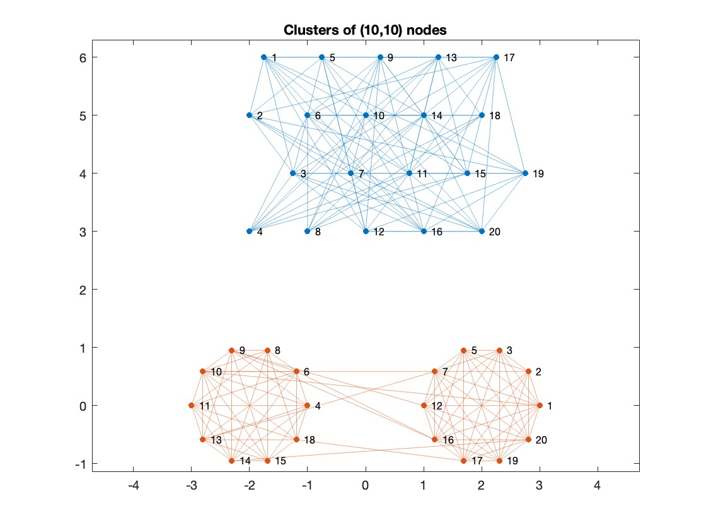

# Binary Clustering of Graph Vertices using the Fiedler Vector

The purpose of this exploration was to use the Fiedler method to produce data clusters from a given edge list dataset and interpret the results using previous knowledge.

The Fiedler vector is the eigenvector of the second smallest of eigenvalue.

The binary clustering using the Fiedler vector is done by assigning positive and negative one values to the vertices and clustering them as such.

    

This algorithm is effective at producing a binary clustering of huge real-world datasets with minimal outliers and appropriate dimensions.